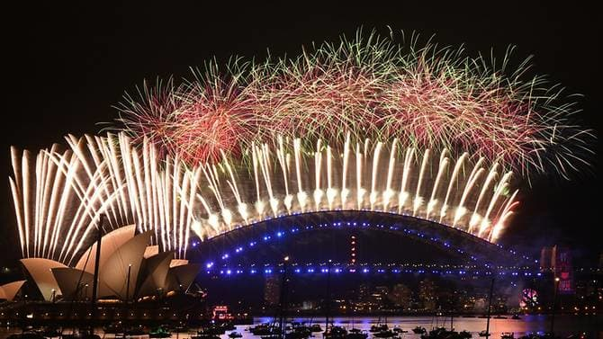

# Hello, World!

Welcome to my blog! Today is the start of 2021 and it's the perfect time to start a blog :). I'm not sure where this blogging will take me, but for the meantime I'll just jot down some of the things I've done in the past and present that hopefully interest you! 

## About me
I guess I should start my first post with an introduction of me. Born in Sydney, Australia, I've had a fairly quiet childhood. My first real interest started in 4th grade when I managed to solve a Rubik's cube for the first time during class. I remember vividly jumping up in joy in the middle of a group activity and getting caught out for not doing my classwork. That passion led me to a number of competitions in and out of Sydney, with my best official time of 9.69 seconds in Tokyo in 2014. 

My next passion emerged during my second year in high school at the robotics club. We started out with C programming and it took me a lot of pain and tears to get a moving robot, but it was the greatest feeling when we went to compete and placed 2nd at local copmetitions :). Later on, I would participate in the Australian Robocup Soccer Competition with my friend, Kevin Zhu, and we placed 2nd in the nation. There'll definitely be a future blog post recounting my experiences here some day! 

Outside of technical work, I also like flying! I took a whole month off school in my final year of high school to go to Oregon, USA to study how to fly instead of studying for my university entrance exams! It was a wild ride and I somehow managed to grab that Private Pilot License just days before I was due to return back home to study before I risked getting my final year terminated at high school haha. I couldn't have done it without the help of my father, to whom I owe a lot of my personality and traits to, as well as my auntie and uncle in Oregon who supported me every step of the way. Again, there'll definitely be a future post about this adventure too!

Over the 2018/19 summer break, my girlfriend and I got our PADI Scuba Diving License! I already had mine for a few years back in Egypt, but it was really fun being able to revisit this fun activity and see the fish again! We have our eyes set on the Great Barrier Reef for our next trip! 

On the side I've also developed a passion for programming and software development. I have an online implementation of the popular "The Resistance: Avalon" game which has approximately 50 unique users a day and many hours worth of games played a day :). It was my second year project and was done very hastily, with many shortcuts taken, so I've been meaning to do a complete re-write that fixes a lot of issues that I encountered and I'm sure to do a post about this too in the future! 

It's difficult to summarise my thoughts in a few lines, but here is my best shot: I'm a final year engineering + science student at The University of Sydney. I love robotics, programming, engineering and the likes which there'll be no shortage of in future posts! 

Outside of technical engineering work, I love adventuring, flying, scuba diving, hiking and challenging myself. I used to be an avid gamer (LoL, Dota 1, Dota 2, CSGO, Minecraft) having played pretty much every popular multiplayer game of my time. Unfortunately I never got very far in that domain... 

Now-a-days I spend my time off learning Chinese and Japanese, and slowly griding through all those One Piece episodes while trying to stop myself from doing more programming (it's actually a problem for me)! 

## 2021 Goals  

